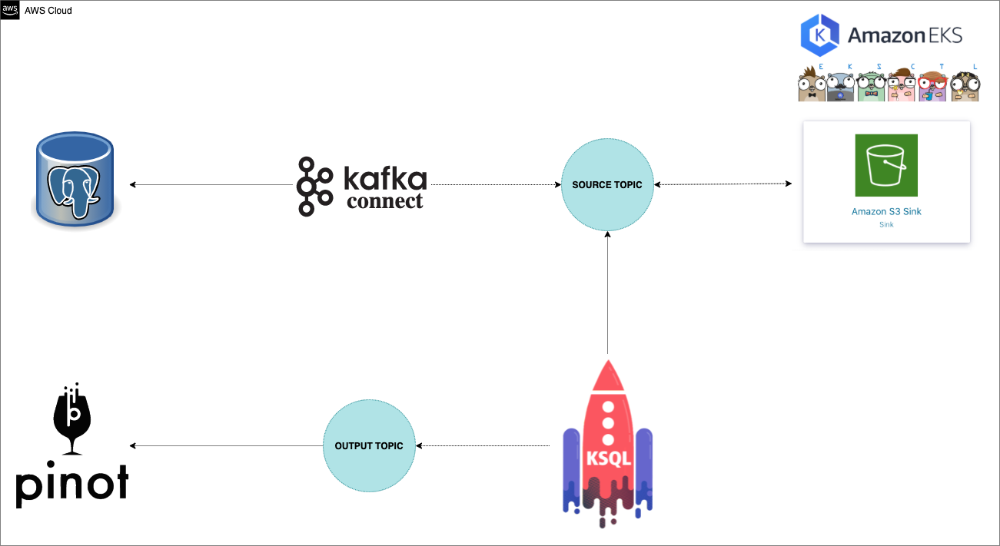

  

<h3 align="center">Bootcamp Engenheiro(a) de Dados Cloud - IGTI - Módulo 2</h3>

---

## 📝 Conteúdo

- [Arquitetura](#architeture)
- [Autor](#authors)

## Arquitetura Orientada a Eventos 

## ⛏️ Built Using 

- EKS
- Kafka Strimzi Operator
- Apache Pinot
- KsqlDB
- Python 

## ✍️ Authors 

- [@carlosbpy](https://github.com/carlosbpy)

Objetivos: 

 Utilizar os principais serviços de nuvem para Engenharia de Dados;
 Utilizar o Kubernetes como Gerenciador de Containers;
 Ingerir dados em real time no Apache Kafka;
 Implementar um pipeline de processamento de Big Data em real time;
 Realizar Processamento de dados utilizando Ksqldb;
 Disponibilizar dados no Apache Pinot.

Enunciado:

Você é Engenheiro(a) de Dados e precisa realizar a migração de uma tabela relacionada a clientes,
que é altamente requisitada pela área de negócios para, assim, realizar análises comportamentais
dos clientes. O gestor de sua área iniciou um projeto de migração para que esses dados sejam
disponibilizados em tempo real, e você será responsável por construir uma pipeline em real time
para disponibilizar esses dados no DW. Você precisará realizar o processamento utilizando
ferramenta adequada e disponibilizar o dado para consultas dos usuários de negócios e analistas de
BI.
Para a realização desta atividade, recomenda-se o uso dos serviços AWS.

Atividades:

Você deverá desempenhar as seguintes atividades:

1. Crie um RDS Postgres que tenha acesso público liberado;
2. Clonar o projeto https://github.com/carlosbpy/igti-k8s-exercise;
3. Ingerir dados da tabela de customers para o postgres;
4. Deployar EKS na AWS ou utilizar o Minikube;
5. Migrar tabela de customers para a estrutura do Kafka;
6. Realizar o processamento dos dados da tabela de customers utilizando o KsqlDB;
7. Disponibilizar dados da tabela de customers em real time para o Apache Pinot.